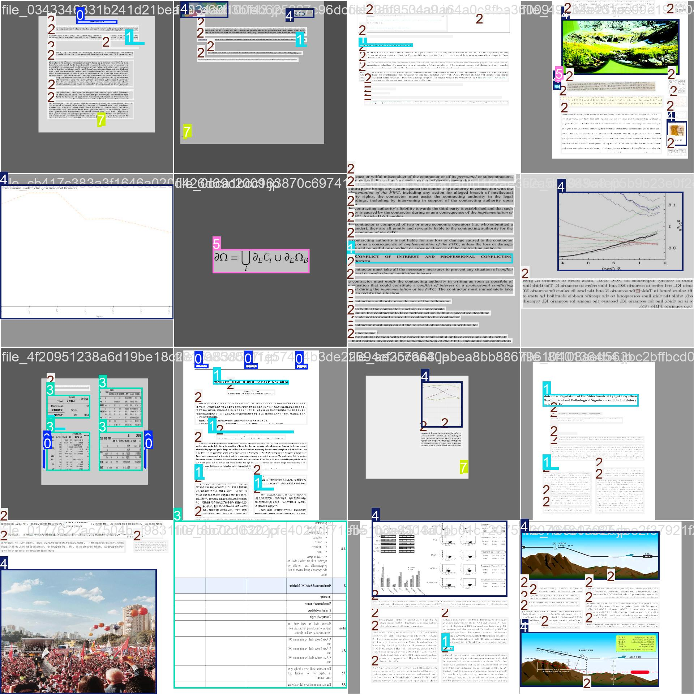

# anydoclayout
- docs layout detection



## train datasets

### 1. labels info
```python
{0: 'header',
 1: 'title',
 2: 'text',
 3: 'table',
 4: 'figure',
 5: 'formula',
 6: 'footer',
 7: 'pagenum'}
```

### 2. datasets info

- train: 841862 (opendata: 667426, selfgen: 174436)
- eval: 5500
- imgsize：1280

### 3. eval results
```python
Class     Images  Instances      Box(P          R)
   all       5500      52274      0.921      0.897
header       1461       2337       0.92      0.878
 title       2308       5473      0.896      0.893 
  text       4149      34156      0.937      0.927
 table       1476       1913      0.946      0.958
figure       1842       3343       0.94       0.94
formula        735       1506      0.881      0.876
footer        745       1157      0.909      0.781
pagenum       2164       2389      0.938      0.919

```

### if you want to get datasets
- email：christnowx@qq.com


### how to use

```python
from pathlib import Path
from ultralytics import YOLO

modelfile = Path(model_dir).joinpath('anydoclayout-yolo11s-imgsz1280.pt')
model = YOLO(modelfile)
res = model.predict('your img file', imgsz = 1280)

```
